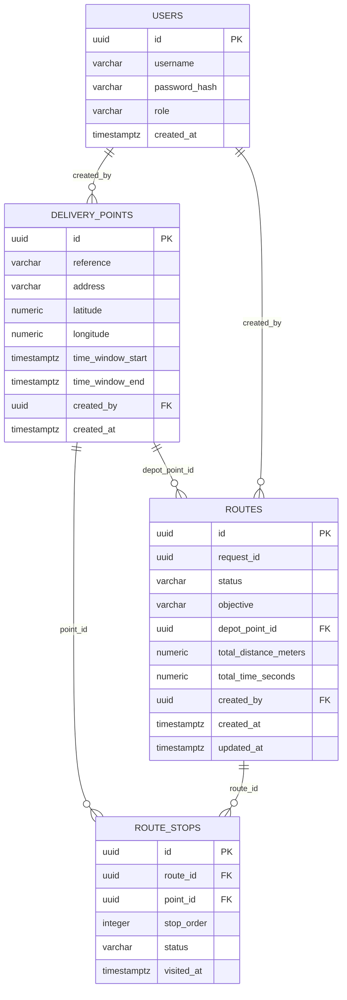

# DB-001 — Esquema de base de datos

Issue: [#24](https://github.com/VectorGarMan/routes-api/issues/24)
Depende de: ARC-001, CTR-001 (ambos cerrados).
Bloquea: BE-002, BE-003, BE-004, BE-012.

## ERD

## Diccionario de datos

### `users`

| Columna | Tipo | Nulo | Descripción |
|---|---|---|---|
| id | UUID (PK) | No | Identificador de integración, generado con `gen_random_uuid()`. |
| username | VARCHAR(100) | No | Único. Usado para autenticación (AUTH-001). |
| password_hash | VARCHAR(255) | No | Hash de contraseña, nunca texto plano. |
| role | VARCHAR(30) | No | Rol del usuario (p. ej. `DRIVER`, `ADMIN`). |
| created_at | TIMESTAMPTZ | No | Fecha de alta. |

### `delivery_points` (mapea `DeliveryPoint` del contrato)

| Columna | Tipo | Nulo | Descripción |
|---|---|---|---|
| id | UUID (PK) | No | Corresponde a `DeliveryPoint.id`. |
| reference | VARCHAR(255) | No | Obligatorio según contrato. |
| address | VARCHAR(500) | Sí | Puede ser `null` si solo se capturan coordenadas. |
| latitude | NUMERIC(9,6) | No | Validado en rango [-90, 90]. |
| longitude | NUMERIC(9,6) | No | Validado en rango [-180, 180]. |
| time_window_start / time_window_end | TIMESTAMPTZ | Sí | Corresponden a `timeWindow.start/end` (ISO-8601). Ambos pueden ser `null`. |
| created_by | UUID (FK users) | Sí | Usuario que capturó el punto. |
| created_at | TIMESTAMPTZ | No | Fecha de captura. |

### `routes` (mapea `RouteResponse` / `OptimizeRequest.requestId`)

| Columna | Tipo | Nulo | Descripción |
|---|---|---|---|
| id | UUID (PK) | No | Identificador interno de la ruta persistida. |
| request_id | UUID | No | Único. Corresponde a `OptimizeRequest.requestId` / `OptimizeResponse.requestId`. |
| status | VARCHAR(20) | No | `CALCULATING`, `ACTIVE`, `COMPLETED`, `ERROR` (igual al contrato `RouteResponse.status`). |
| objective | VARCHAR(20) | No | `DISTANCE` o `TIME`. |
| depot_point_id | UUID (FK delivery_points) | No | Punto de partida (`depotIndex` resuelto a `pointId`). |
| total_distance_meters | NUMERIC(12,2) | Sí | Metros, nunca kilómetros (conversión solo en presentación). |
| total_time_seconds | NUMERIC(12,2) | Sí | Segundos, nunca minutos. |
| created_by | UUID (FK users) | Sí | Usuario/chofer que solicitó el cálculo. |
| created_at / updated_at | TIMESTAMPTZ | No | Auditoría. |

### `route_stops` (mapea `RouteResponse.stops`)

| Columna | Tipo | Nulo | Descripción |
|---|---|---|---|
| id | UUID (PK) | No | Identificador interno de la parada. |
| route_id | UUID (FK routes) | No | Ruta a la que pertenece. `ON DELETE CASCADE`. |
| point_id | UUID (FK delivery_points) | No | Punto de entrega visitado en esta parada. Nunca se usa un índice de matriz aquí. |
| stop_order | INTEGER | No | Orden de visita (0-based, igual al orden de `route`/`routeIndexes`). Único por ruta. |
| status | VARCHAR(20) | No | `PENDING`, `CURRENT`, `VISITED`. |
| visited_at | TIMESTAMPTZ | Sí | Fecha en que se marcó visitada. |

## Decisiones de diseño

- Todos los IDs expuestos a React/Python son UUID (`gen_random_uuid()`), nunca IDs numéricos autoincrementales, para no acoplar la integración a claves internas de BD.
- `latitude`/`longitude` se guardan como `NUMERIC(9,6)` (grados decimales), suficiente precisión para geolocalización vehicular (~11 cm).
- Las ventanas de tiempo y timestamps de auditoría usan `TIMESTAMPTZ` para preservar compatibilidad con ISO-8601 con zona horaria.
- `routes.request_id` es único: garantiza que un mismo `OptimizeRequest` no se persista dos veces.
- `route_stops` nunca reordena `delivery_points`; el orden real vive en `stop_order`, resuelto siempre por `point_id` (nunca por índice de matriz), conforme a la regla del contrato global.
- Las validaciones de rango de coordenadas se aplican también a nivel de base de datos (`CHECK`) como defensa adicional a la validación de aplicación (BE-002).

## Implementación

- El esquema se aplica manualmente ejecutando `sql/schema.sql` contra la base de datos (sin herramienta de migración automática).
- `spring.jpa.hibernate.ddl-auto=none`: Hibernate no crea, valida ni modifica el esquema; el script SQL es la única fuente de verdad.
- Credenciales de conexión (`DB_URL`, `DB_USERNAME`, `DB_PASSWORD`) se leen de variables de entorno, con valores por defecto solo para desarrollo local.

## Verificación (`done_when`)

- [x] El esquema coincide con el contrato (`global_data_contract.models`).
- [x] Relaciones y restricciones documentadas (ver diccionario de datos y `CHECK`/`FK` en el script).
- [x] El script puede ejecutarse desde cero: `sql/schema.sql` no depende de datos previos.
